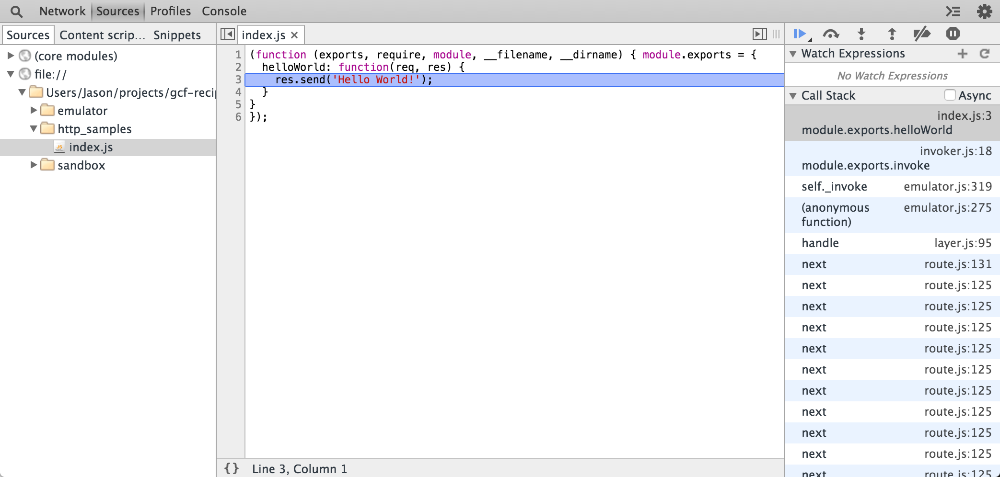

# Google Cloud Functions Emulator

[![NPM][1]][2]
[![Tests][3]][4]
[![Coverage][5]][6]

[1]: https://img.shields.io/npm/v/@google-cloud/functions-emulator.svg?style=flat
[2]: https://www.npmjs.org/package/@google-cloud/functions-emulator
[3]: https://img.shields.io/circleci/project/GoogleCloudPlatform/cloud-functions-emulator/master.svg
[4]: https://circleci.com/gh/GoogleCloudPlatform/cloud-functions-emulator
[5]: https://img.shields.io/codecov/c/github/GoogleCloudPlatform/cloud-functions-emulator/master.svg
[6]: https://codecov.io/github/GoogleCloudPlatform/cloud-functions-emulator

_Disclaimer: This is not an official Google product._

This is a simple emulator that allows you to test your Cloud Functions on your
local machine.

**@google-cloud/functions-emulator is currently in pre-1.0.0 development. Before
the 1.0.0 release backwards compatible changes and bug fixes will bump the patch
version number and breaking changes will bump the minor version number.**

## Table of Contents

* [Installation](#installation)
* [Authentication] (#authentication)
* [Using the CLI](#using-the-cli)
  * [Deployment](#deployment)
  * [Invoking a Function](#invoking-a-function)
  * [Config](#config)
  * [Logs](#logs)
  * [Debugging](#debugging)
    * [Debugging with Visual Studio Code](#debugging-with-visual-studio-code)
    * [Debugging with Chrome Developer Tools](#debugging-with-chrome-developer-tools)
    * [Debugging with WebStorm](#debugging-with-webstorm)
  * [Using Mocks](#using-mocks)
  * [Known issues and FAQ](#known-issues-and-faq)

## Installation

    npm install -g @google-cloud/functions-emulator

Installing `@google-cloud/functions-emulator` globally with the `-g` flag adds
the `functions` executable to your `PATH` so you can run the CLI from anywhere.

## Authentication

If you're using Cloud Functions to access other Google Cloud Platform APIs (e.g.
Google Cloud Storage or the Google Cloud Vision API), you can use the same
[Application Default Credential][adc] as you would when running your function
in the cloud.

For example, when using the [google-cloud][google-cloud-node] Node.js module for
Cloud Storage, the following:

```javascript
const Storage = require('@google-cloud/storage');
const storage = Storage({
  projectId: 'grape-spaceship-123',
  keyFilename: '/path/to/keyfile.json'
});
```
can be abbreviated to:

```javascript
const Storage = require('@google-cloud/storage');
const storage = Storage();
```

This abbreviated version will use the *Application Default Credential* as the
authentication principal, and in the emulator will use the `GCLOUD_PROJECT`
environment variable or the `projectId` property of your `config.json` file as
the projectId.

In order for this credential to be correctly injected into the emulator, you
need to have already authenticated the
[Cloud SDK](https://cloud.google.com/sdk/gcloud/), via either `init`:

    gcloud init

or by manually invoking `auth`:

    gcloud auth login

To activate the Application Default Credentials run:

    gcloud beta auth application-default login

To verify that the *Application Default Credential* is present, you can request
the current access token using:

    gcloud beta auth application-default print-access-token

*Note: The current project defined in `gcloud config` must match the `projectId`
set in `config.json` for the Application Default Credential to work. If you want
to authenticate your Cloud Function against a different project you will need to
also include a keyfile as described in the `google-cloud-node`
[authentication guide][auth].*

[adc]: https://developers.google.com/identity/protocols/application-default-credentials
[google-cloud-node]: https://github.com/GoogleCloudPlatform/google-cloud-node
[auth]: https://googlecloudplatform.github.io/google-cloud-node/#/docs/google-cloud/latest/guides/authentication

## Using the CLI

Print the available commands:

    functions --help

### Usage

    Commands:
      call <functionName>      Invokes a function. You must specify either the "data" or the "file" option.
      clear                    Resets the emulator to its default state and clears and deployed functions.
      config <command>         Manages emulator configuration.
      delete <functionName>    Undeploys a previously deployed function (does NOT delete the function source code).
      deploy <functionName>    Deploys a function with the given module path and function name (entry point).
      describe <functionName>  Describes the details of a single deployed function.
      kill                     Force kills the emulator process if it stops responding.
      list                     Lists deployed functions.
      logs <command>           Manages emulator logs access.
      prune                    Removes any functions known to the emulator but which no longer exist in their corresponding
                               module.
      restart                  Restarts the emulator.
      start                    Starts the emulator.
      status                   Reports the current status of the emulator.
      stop                     Stops the emulator gracefully.

    Options:
      --grpcHost  The host the gRPC Service should run on.                                                          [string]
      --grpcPort  The port the gRPC Service should run on.                                                          [number]
      --restHost  The host the REST Service should run on.                                                          [string]
      --restPort  The port the REST Service should run on.                                                          [number]
      --help      Show help                                                                                        [boolean]
      --version   Show version number                                                                              [boolean]

    Examples:
      cd /path/to/module/dir; functions deploy helloWorld       Deploy helloWorld as an HTTP function from the module
      --trigger-http                                                located in /path/to/module/dir.
      functions deploy helloWorld                               Deploy helloWorld as an HTTP function from the module
      --local-path=/path/to/module/dir --trigger-http               located in /path/to/module/dir.
      functions call helloWorld                                 Invoke the helloWorld function with no data argument
      functions call helloWorld --data='{"foo": "bar"}'         Invoke the helloWorld function with a JSON document
                                                                    argument
      functions call helloWorld --file=~/myData/datafile.json   Invoke the helloWorld function with a file argument
      functions logs read --limit=10                            Display the most recent 10 lines from the logs

    Read more at https://github.com/GoogleCloudPlatform/cloud-functions-emulator

Get help on a specific command passing `--help` to the command, for example:

    functions call --help

which would print:

    functions call <functionName>

    Options:
      --host, -h  The emulator's host.                                                                              [string]
      --port, -p  The emulator's port.                                                                              [number]
      --help      Show help                                                                                        [boolean]
      --version   Show version number                                                                              [boolean]
      --data, -d  Specify inline the JSON data to send to the function.                                             [string]
      --file, -f  A path to a JSON file to send to the function.                                                    [string]

### Deployment

The emulator can host both BACKGROUND and HTTP (foreground) Cloud Functions. By
default the emulator will consider functions deployed to be BACKGROUND
functions. To deploy an HTTP function, use the `--trigger-http` argument:

    functions deploy <functionName> --local-path=<modulePath> --trigger-http

*Note: The `modulePath` should be a directory containing the Node.js module you
want to deploy.*

For example:

    functions deploy helloWorld --local-path=~/myModule --trigger-http

This would deploy the `helloWorld` function in the Node.js module contained in
the `~/myModule` path.

If you run the command in your function's module directory then you can drop the
`--local-path` flag:

    cd /path/to/module/dir
    functions deploy helloWorld --trigger-http

### Invoking a Function

Start the Emulator:

    functions start

Deploy a BACKGROUND function *(the first argument is the path to your module,
the second argument is the name of the function)*:

    functions deploy helloWorld --local-path=../myModule

Invoke the function:

    functions call helloWorld

Stop the Emulator:

    functions stop

For HTTP functions, just use the `--trigger-http` argument.

Deploy an HTTP function:

    functions deploy helloHttp --local-path=../myModule --trigger-http

Invoke the function (default port is 8008):

    curl http://localhost:8008/helloHttp

#### Invoking Functions with arguments

When using the `call` command, you can optionally provide a `--data` argument to
send data to your function. This should be expressed as a JSON document, for
example:

    functions call helloWorld --data='{"foo":"bar"}'

When calling HTTP functions in this way, your function will receive an HTTP POST
with the JSON document as the request body.

Crafting lengthy JSON documents at the command line can be cumbersome, so you
can specify a path to a JSON file with the `--file` option:

    functions call helloWorld --file=/usr/local/somedata.json

This example will load `/usr/local/somedata.json` and pass its contents as the
argument to the function.

*Note: file arguments are assumed to be `utf-8` encoded text files.*

### Config

A `config.json` file in your home directory allows you to customize default
settings for the emulator. Here are some of the options:

| Property | Type | Description |
|-------|---|----------|
| logFile | string | Path to the logs file. Default: `logs/cloud-functions-emulator.log`. |
| projectId | string | Your Cloud Platform project ID. Default: `process.env.GCLOUD_PROJECT`. |
| timeout | integer | Timeout (ms) to wait for the emulator to start. Default: `3000`. |
| useMocks | boolean | Whether `mocks.js` should be loaded when the emulator starts. Default: `false`. |
| verbose | boolean | Whether the emulator should write additional logs during operation. Default: `false`. |

View the configuration saved to the Emulator `config.json` in your user's home
directory:

    functions config list

or as JSON:

    functions config list --json

Update a particular setting:

    functions config set verbose true

Restart the Emulator for changes to take effect:

    function restart

View the configuration of the currently running Emulator:

    functions status

### Logs

Functions running in the emulator run in their own (detached) process, so
console logs from your function (e.g. `console.log()` calls) will not be piped to
the stdout stream of the emulator. Instead a log file can be found in **logs/cloud-functions-emulator.log**

You can view the logs from your functions using the `logs read` command:

    functions logs read

By default this will return the most recent 20 log lines. You can alter this
with the `--limit` flag.

    functions logs read --limit=100

Alternatively, you can simply *tail* the log file itself.

Mac/Linux:

    tail -f logs/cloud-functions-emulator.log

(Note this log will automatically roll when it reaches 1MB.)

### Debugging

To start the emulator in *debug* mode, use the `--debug` (to use the current
Node.js Debugger) or `--inspect` (to use the new experimental Debugger) flags:

    functions start --debug

or

    functions start --inspect

While running in debug mode a separate debug server will be started on port 5858
or 9229 (for `--debug` and `--inspect` respectively). You can then attach to the
debugger process with the tool of your choice.

#### Debugging with Visual Studio Code

If you started the emulator with the `--inspect` flag, you can "Attach" to a
running function from within Visual Studio Code.

Refer to the documentation for [debugging in Visual Studio Code](https://code.visualstudio.com/Docs/editor/debugging) for more information. Basically, you just need a `launch.json` file that looks
like this:

    {
      "version": "0.2.0",
      "configurations": [
        {
          "name": "Attach to Process",
          "type": "node2",
          "request": "attach",
          "port": 9229
        }
      ]
    }

In Visual Studio Code, navigate to the source code for your locally deployed
function and set a breakpoint inside your function. Then when the function is
invoked, execution should pause on your breakpoint inside the Debug View of
Visual Studio Code.

#### Debugging with Chrome Developer Tools

To access the debugger in Chrome, you'll need to inspect the log file written by
the emulator, which by default is located in `logs\cloud-functions-emulator.log`.
You can quickly view the logs with `functions logs read`.

Look for a log entry that appears like this:

    Debugger listening on port 9229.
    Warning: This is an experimental feature and could change at any time.
    To start debugging, open the following URL in Chrome:
        chrome-devtools://devtools/remote/serve_file/@60cd6e839b9f557d231sf5bf532f6aec5f284980/inspector.html?experiments=true&v8only=true&ws=localhost:9229/165s71ce-1e76-421f-b52d-e3b8a14bcb0c

When you open the chrome devtools debugger you may not see your function source
file. Just invoke your function once to have its source file appear in the
debugger window. You can then set breakpoints and debug like normal.



#### Debugging with WebStorm

Create a Node.js Remote Debugger configuration. In the Emulator, set `debug` to
`true` (`functions start --debug` or
`functions config set debug true; functions restart`). When your function is
invoked and then paused, attach to the debugger in WebStorm by running the debug
configuration you created.

#### Using the old debugger

You can also use the older `--debug` flag and debug your Cloud Functions in the
emulator using [node-inspector][].

First, install node-inspector:

    npm install -g node-inspector

Start the emulator with the `--debug` flag:

    functions start --debug

Now start the node inspector process in a separate console window:

    node-inspector

This will start an HTTP server on port 8080, you can then browse to this URL in
Chrome:

    open http://127.0.0.1:8080/?port=5858

Now when you invoke your function, you can debug:

    functions call helloWorld

[node-inspector]: https://github.com/node-inspector/node-inspector

### Using Mocks

When running functions locally you sometimes want to change the behavior of
modules which connect to external services. For example you might be accessing a
database, API or external system that you don't want to, or can't access from
your local environment.

The Cloud Functions Emulator provides a way to inject *mock* versions of Node.js
modules imported into your function.

1. Enable the use of mocks:

        functions start --useMocks

    or

        functions config set useMocks true
        functions start

2. Edit `mocks.js` and mock the dependencies you want

        // You can create handcrafted mocks, or use a mocking library
        var sinon = require('sinon');

        /**
         * Called when the require() method is called
         * @param {String} func The name of the current function being invoked
         * @param {String} module The name of the module being required
         */
        exports.onRequire = function (func, module) {
            // Return an object or module to override the named module argument
            if (module === 'redis') {
                // Create a mock of redis
                var mockRedis = sinon.mock(require('redis'));
                mockRedis.expects('createClient').returns({});

                // Mock more methods as needed...

                return mockRedis;
            }
            return undefined;
        };

3. You don't need to change your function code at all!

        exports.helloRedis = function (event, callback) {
          var redis = require('redis'); // this will be a mock
          cvar lient = redis.createClient();

          // ...
        };


### Known Issues and FAQ

- If you see the following error in the console when you stop the debugger:

        Assertion failed: ((err) == (0)), function Stop, file ../src/debug-agent.cc, line 155.

    You can safely ignore it. It's an [open issue](https://github.com/nodejs/node/issues/781) in Node.js

- If you restart the emulator while the debug server is running you may need to
refresh the browser for the default debug breakpoint to fire.

- Disconnecting the debugger can sometimes leave the emulator in a *weird*
state. If you want to kill the emulator process (because it's stuck), then
you'll have to kill the underlying `node` process:

        functions kill

    If that doesn't work, then you may need to go medieval

        Mac/Linux:

        pgrep -f emulator.js | xargs kill

- If you see the following error when deploying:

        Error: Module version mismatch

    This usually means that the module you are trying to deploy has a dependency
    that either conflicts with the same dependency in the emulator, but has a
    different version, or it indicates that the dependencies in the module being
    deployed was built with a different version of npm. In most cases, deleting
    `node_modules` from the module being deployed and re-running `npm install`
    will resolve this.

- If you see the following error when trying to invoke a function:

        TypeError: res.send is not a function

    It means you deployed an HTTP function as a BACKGROUND function (so it's
    expecting an HTTP request but the emulator didn't give it one). Make sure
    to deploy HTTP functions with the `--trigger-http` flag.

- If the emulator times out when starting, check the logs
(`logs\cloud-functions-emulator.log`). If you see the following error:

        Unable to open devtools socket: address already in use

    It means the chrome devtools debugger is running and using the default debug
    port. Close the Chrome tab with the debugger and try again.

## License

Copyright 2016, Google, Inc.

Licensed under the Apache License, Version 2.0

See the [full license](https://github.com/GoogleCloudPlatform/cloud-functions-emulator/blob/master/LICENSE).
